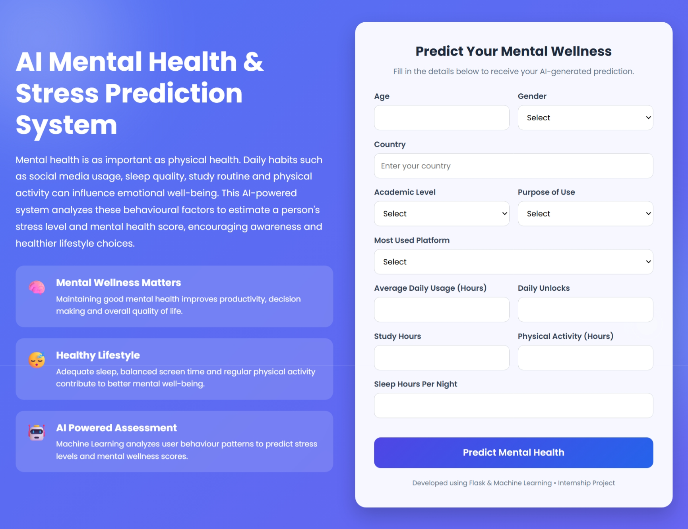
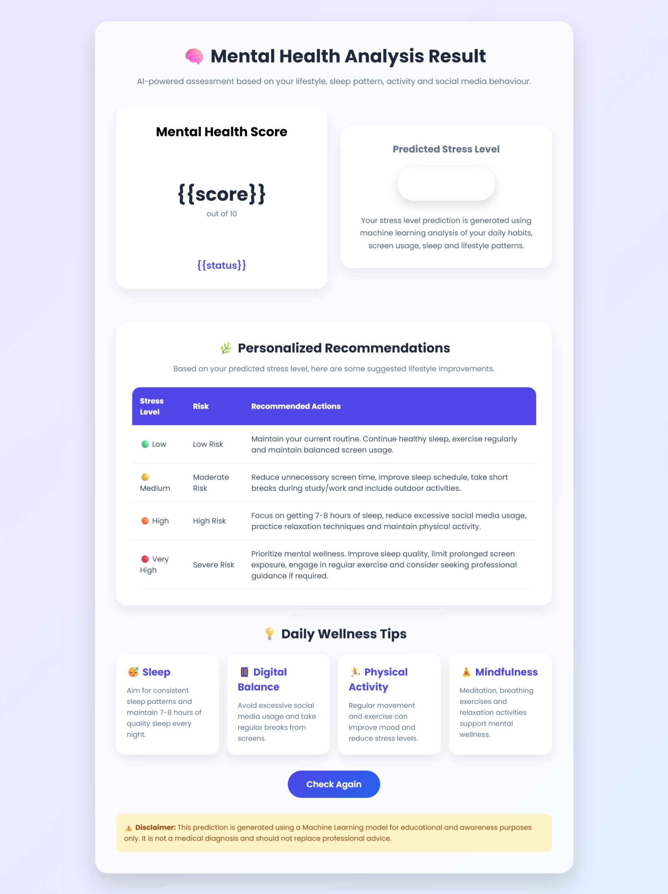

 AI-BASED MENTAL HEALTH AND STRESS PREDICTION SYSTEMw

The AI-Based Mental Health & Stress Prediction System is a Machine Learning-powered web application that analyzes a person's lifestyle and behavioural patterns to predict:

1. Stress Level Classification
2. Mental Health Score Estimation

The system uses factors such as social media usage, sleep patterns, study hours, physical activity, and demographic information to understand behavioural patterns and provide AI-generated predictions along with wellness recommendations.

The application is developed using Machine Learning, Python, Flask, HTML, and CSS to create an interactive and user-friendly platform.

OBJECTIVES

The main objectives of this project are:

Analyze lifestyle factors affecting mental health.
Predict stress categories using Machine Learning.
Estimate mental health scores based on behavioural patterns.
Develop a web-based interface for easy user interaction.
Provide personalized recommendations based on predicted risk levels.

MACHINE LEARNING APPROACH

The project uses two separate Machine Learning models because the outputs are different types of predictions.

1️⃣ Stress Level Prediction Model
Problem Type - Classification

2️⃣ Mental Health Score Prediction Model
Problem Type - Regression

TOOL AND TECHNOLOGY

1. Pandas - Data loading, cleaning, manipulation, and analysis.
2. NumPy - Numerical computations and feature engineering.
3. Scikit-learn	- Data preprocessing, model training, evaluation, and prediction.
4. Flask - Backend framework used to connect the machine learning models with the web interface.
5. Joblib - Saving and loading trained machine learning models (.pkl files).
6. HTML5 - Creating the structure of the web pages.
7. CSS3 - Styling the web pages and making them responsive and visually appealing.
8. Google Colab - Training, testing, and evaluating the machine learning models.
9. Visual Studio Code (VS Code) - Developing and debugging the Flask application and frontend code.
10. Kaggle - Source of the dataset used for training and testing the models.

FUTURE ENHANCEMENTS

Possible improvements:

Add chatbot-based mental health assistant.
Include sentiment analysis from text inputs.
Deploy on cloud platforms.
Add user history tracking.
Integrate wearable health data.
Improve recommendation personalization.